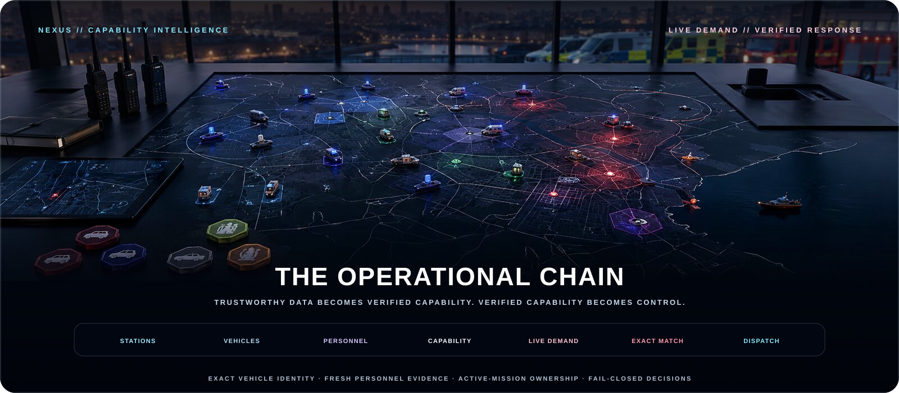
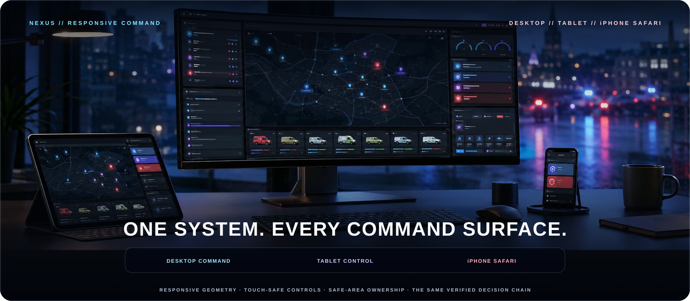

# MissionChief Command Nexus

### The operational command layer for MissionChief UK

**Prepare resources. Prove capability. Read the mission that exists now. Dispatch with control.**

<table>
<tr>
<td width="50%" align="center"><a href="https://greasyfork.org/en/scripts/587702-missionchief-command-nexus"><strong>⬇ INSTALL OR UPDATE</strong> The supported Greasy Fork distribution</a></td>
<td width="50%" align="center"><a href="https://github.com/Team-Killing-Bastards/MissionChief-Command-Nexus/releases/latest"><strong>◈ OPEN LATEST RELEASE</strong> Verified userscript, checksum and mission brief</a></td>
</tr>
<tr>
<td width="50%" align="center"><a href="src/missionchief-command-nexus.user.js"><strong>⌘ INSPECT CANONICAL SOURCE</strong> The single authoritative userscript on main</a></td>
<td width="50%" align="center"><a href="https://github.com/Team-Killing-Bastards/MissionChief-Command-Nexus/issues"><strong>⚠ OPEN COMMAND QUEUE</strong> Defects, evidence gaps and approved roadmap work</a></td>
</tr>
</table>

**Current version:** `1.1.12` · **Mission Finder engine:** `V10.7.7` · **Platform:** [MissionChief UK](https://www.missionchief.co.uk/) · **Licence:** [MIT](LICENSE)

[**Command brief**](#command-brief) · [**What is live**](#current-production-intelligence) · [**Capabilities**](#capability-atlas) · [**Install**](#install-in-60-seconds) · [**Platforms**](#command-surfaces) · [**Safety**](#safety-doctrine) · [**Architecture**](#system-architecture) · [**Ownership**](#ownership-and-contribution-record)

> [!NOTE]
> Command Nexus is an independent community userscript for the MissionChief UK website. The cinematic artwork is conceptual product imagery, not an official MissionChief interface or a real emergency-service system.

## Command brief

Command Nexus joins two established MartyBlyth systems into one maintained installation: **Resource Administration** prepares the estate; **Mission Operations** interprets live demand and controls response. Between them sits a verified vehicle-training register that turns a vehicle label into evidence-backed capability.

<table>
<tr>
<td width="50%" valign="top">

### 🧭 Resource Administration

- Station and vehicle naming through verified background form submissions
- Dispatch Centre → Service → Station Type → Start From hierarchy
- Medical, Fire/Airfield, Police and SAR/Coastguard Personnel Assignment
- Preview and bounded Live modes with pause, stop and reporting
- Fresh Personnel Register builds and specialist training intelligence
- Normal, embedded and standalone Stations workspaces

</td>
<td width="50%" valign="top">

### 🛰️ Mission Operations

- Authoritative live-requirement and patient interpretation
- Complete vehicle-list loading before selection
- Exact vehicle, companion and trained-personnel matching
- Unit Finder, Mission Update and controlled Auto Mode
- Mission upgrades, sharing, queues, transports and recovery
- Stale-mission, zero-selection and repeated-dispatch protection
- Opt-in private activity recorder with stable MissionChief profile identity, exact dispatch/credit evidence and verified weekly archive rollover

</td>
</tr>
</table>

> [!IMPORTANT]
> **MartyBlyth is the creator, principal userscript author, technical owner, and release authority.** Command Nexus remains **MartyBlyth's project**. **Conroy1988 is the project helper** for repository infrastructure, documentation, validation, and general operations; after identifying the mobile workflow gap, he requested Marty's permission and independently initiated, designed, and implemented the scoped **iOS Safari compatibility** work delivered across v1.0.15-v1.0.18. That contribution does not change the project's overall ownership.

## Current production intelligence

The current production line is not merely a merged pair of scripts. It is a guarded decision system with live, exact UK mappings and permanent regressions behind every recent expansion.

<table>
<tr>
<td width="50%" valign="top"><strong>ALL-SERVICE PERSONNEL PROFILES</strong> Live Medical, Fire/Airfield, Police and SAR/Coastguard profiles use exact vehicles, courses, seats and eligible station types. Full-service batches preserve specialist-first ordering and merge overlapping qualifications onto the same actual crew.</td>
<td width="50%" valign="top"><strong>COMPANION VEHICLE AUTHORITY</strong> Pods, boats, flood units, hovercraft and rescue-watercraft trailers resolve MissionChief's actual tractor relationship. Explicit links win; only a unique one-to-one fallback is accepted; ambiguity blocks.</td>
</tr>
<tr>
<td width="50%" valign="top"><strong>STRICT VEHICLE FAMILIES</strong> Rescue Stairs before CARPs, RIVs before Rescue Pumps, exact Search Dog type 102, bounded Fire/Police drone families, RRU type 107 and other specialist pools remain deliberately separate from generic fallback.</td>
<td width="50%" valign="top"><strong>FRESH EVIDENCE OR NO DISPATCH</strong> Missing or stale register entries may enter the live verification scan, but only fresh, complete assignment evidence can satisfy trained-personnel demand. Incomplete coverage remains blocked—including in Auto Mode.</td>
</tr>
<tr>
<td width="50%" valign="top"><strong>BACKGROUND RESOURCE OPERATIONS</strong> Unit Naming, Station Naming and Personnel Assignment use same-origin native forms and verify the saved state without opening resource lightboxes. Standalone and late-rendered Stations views recover current Dispatch Centre membership.</td>
<td width="50%" valign="top"><strong>ACTIVE-MISSION OWNERSHIP</strong> Mission requirements, vehicle controls, selections and final confirmation stay bound to the exact active mission document—even across responsive pages, same-origin frames, lightboxes and iOS Safari layouts.</td>
</tr>
<tr>
<td width="50%" valign="top"><strong>PAIRED MISSION ANALYTICS</strong> Disabled-by-default browser pairing records player-separated mission demand, dispatch snapshots, journey distance/ETA, timing and completion evidence through a bounded five-minute queue.</td>
<td width="50%" valign="top"><strong>EXACT CREDIT EVIDENCE</strong> Actual awards are accepted only from an exact native Credits-ledger match. Advertised averages remain separate and ambiguous transactions remain pending.</td>
</tr>
</table>

## The operational chain

### 1. Build trustworthy resource data

Resource Administration discovers the current station estate, works through MissionChief's native forms in the background and verifies every saved name or assignment. Preview, scope, pause, stop and outcome reporting keep bulk work bounded.

### 2. Read the mission that exists now

Unit Finder prioritises the exact active mission's visible **Missing Vehicles** and supported **Missing Personnel** shortages. When no current shortage owns the pass, it fetches the authoritative **Requirements for this Mission** route and proves that its mission type and `mission_id` match the active incident.

### 3. Load the whole candidate pool

Every visible `Load more vehicles` control is processed sequentially. Command Nexus requires the final non-zero vehicle set to become ID-stable, and it blocks if loading stalls, the mission changes or the bounded timeout is reached.

### 4. Match capability, not labels

Selection can combine exact vehicle IDs, actual tractor relationships, assignment-page evidence, the verified training register, live patients, selected and responding units, transport state and the current mission owner.

### 5. Confirm before action

Unit Finder prepares. Mission Update reconciles. Auto Mode checks readiness and exact checked state before dispatch. Unsupported demand, stale state, qualification shortfall and cross-mission drift stop the chain.

## Capability atlas

### Resource command

| Surface | Production behaviour |
|---|---|
| **Station Naming** | Builds structured names, previews scope, submits the exact native form in the background and verifies the saved value with a fresh read |
| **Unit Naming** | Applies service-aware captions, callsigns and numbering with exact vehicle-ID ownership and post-save verification |
| **Dispatch Centre hierarchy** | Discovers native type-7 control centres and row membership, then progressively scopes Service, Station Type and Start From |
| **Personnel Assignment** | Plans and performs exact course/vehicle/seat assignments with Preview and Live routes sharing the same rules |
| **Personnel Register** | Quick-refreshes or fully verifies actual assigned personnel and qualifications without changing assignments |
| **Reports and recovery** | Separates changed, skipped, failed, unfilled, training-shortage and verification outcomes; supports bounded pause and stop paths |

### Mission command

| Surface | Production behaviour |
|---|---|
| **Unit Finder** | Parses current demand, loads all candidates and selects mapped vehicles and evidence-backed trained personnel |
| **Mission Update** | Re-reads live requirements, patients and alerts, then adds only the remaining actionable shortage |
| **Auto Mode** | Runs a managed read → load → match → verify → dispatch → continue cycle with explicit stop reasons |
| **Patients and custody** | Reconciles ambulances, patient transports, prisoners and continuation actions when static mission text is incomplete |
| **Mission lifecycle** | Handles upgrades, Dispatch & Share, queue continuation, end-of-queue recovery and the current seasonal collectible route |
| **Mission Analytics** | Records exact selected units, dispatch-time route distance/ETA, first-dispatch and completion timing, advertised value and evidence-backed actual credits for explicitly paired browsers |
| **Diagnostics** | Records selection, skip, blocker and failure decisions while guarding mission ownership, repeated actions and long-session cleanup |

<strong>Open the exact UK vehicle and personnel coverage</strong>

#### Fire and Airfield

- Railway Fire uses two trained personnel per exact type-107 Road Rail Unit.
- Level 1 Incident Commander uses three trained personnel per exact type-15 ICCU.
- HazMat uses six trained personnel per exact type-39 Fire OSU.
- ARFF uses exact Airfield types 75/76 at four personnel and types 77/78 at two.
- Co-Responder and Fire Drone use exact types 18 and 90.
- High Volume Pump and Fire Lifeguard resolve the actual type-40/type-50 and type-73/type-74 tractor-companion relationship.
- BASU, Welfare and HazMat can reuse one selected Fire OSU; type-86 SAR vans remain separate.
- Fire, rescue or aerial appliance maps to Rescue Pump; Road Rail Unit maps to RRU.
- Firefighters convert at nine personnel per Rescue Pump.
- Fire Engines or RIVs exhaust exact type-76 RIVs, then fill the remainder with exact type-16 Rescue Pumps.
- Aerial Appliance Truck(s) or Rescue Stairs exhaust exact type-78 Rescue Stairs, then fill only the remainder with exact type-17 CARPs.
- RIV or Major Foam Tender prefers RIV and uses Major Foam Tender only when no RIV is available.

#### Police

- Generic Police attendance prefers verified ordinary type-8 IRVs, then stale/unknown type-8 IRVs, with specialist-trained IRVs as the final fallback.
- Level 1, Level 2, Sergeant, Railway Police and Police Medic demand can use exact type-51 PSUs at nine staff or exact type-8 IRVs at two when fresh register evidence proves the training.
- Police Inspector and Railway Police remain strict trained type-8 profiles.
- Armed Personnel and Armed Response Personnel use exact type-25 Armed Traffic Cars.
- Armed Traffic selection verifies Roads Policing plus Firearms capability.
- Search Advisor uses an exact registered vehicle carrying assigned `search_and_rescue`-trained staff.
- Unit Naming retains distinct ARV, JRU, Traffic Car, Firearms Personnel Carrier, Recovery and HGV Recovery identities.

#### SAR, Coastguard and specialist rescue

- Search Dog and Rescue Dog use evidence-backed native type 102; Police Dog / Dog Support type 12 stays separate.
- Generic prefixed Drone requirements can use exact SAR Drone type 89 or Police Drone type 91 by arrival; explicit Police air requirements stay strict.
- Operational Support or SAR Vehicle uses exact type-86 Operational Support Van.
- SAR Commander converts to Control Van capability.
- Cave, Coastal Air/Command/Search, Dog, Drone, Flood, Hovercraft, Jet Ski, Lifeboat, Lifeguard, Mud, Rope and Search Management profiles are live.
- Seagoing Vessel recognises supported ALB, ABL and All-weather Lifeboat variants.
- ATV Carrier uses exact type 30; generic 4x4 matching uses type 66.
- SAR batches merge compatible qualifications onto the same actual crew instead of competing for extra seats.

#### Medical, recovery and cross-service demand

- Medical Personnel Assignment includes live Ambulance Officer, HART, Tactical Command, SORT, Midwifery and Specialist Paramedic profiles.
- Patient and ambulance demand is reconciled across repeated selection passes.
- Car Recovery and explicit car, truck, lorry, van or vehicle towing use exact type-105 Flatbed Recovery Vehicles.
- Numeric Still Needed values are direct additional shortages; bounded values such as `0-3` use their upper actionable bound.
- A literal unknown `?` falls back to the required total and deducts existing matching selections.

## Opt-in mission analytics

- **Sharing & Sync** is disabled by default and is controlled by one checkbox. The approved private Apps Script `/exec` endpoint is compiled into this trusted two-user build, so there is no URL field, user selector, Save, Sync or Forget control.
- Identity is detected automatically from MissionChief's native `#navbar_profile_link`: the numeric profile ID is stable, the visible username remains current and the browser device ID is diagnostic only. Enabling the checkbox starts automatic recording and drains any retained backlog without deleting its queue or pending batch.
- The logger records mission identity, advertised value, live demand, patient/prisoner counts, available generator information and the exact selected vehicle IDs, types, names, stations and status for native manual, shared, Auto Mode and Ally Steal dispatch controls. When MissionChief exposes them, each selected row also contributes its dispatch-time estimated route distance and ETA; missing values stay blank.
- A persistent bounded queue sends batches every five minutes. Stable batch IDs and independent backend deduplication make retries safe, including repair when an earlier write stopped before all dispatched-unit rows were stored.
- MissionChief's native finish callback records completion for missions dispatched by the paired browser. Mission Summary exposes first observed, first unit sent, completion, response time and mission duration even after the mission closes.
- After completion, Nexus reads the signed-in player's native Credits list locally and records an award only for the same mission ID and title, or a unique title/time match. Ambiguous transactions remain `PENDING_TRANSACTION`.
- Raw Mission Events, Dispatch Units and Uploads move into verified ISO-week archive spreadsheets. Compact Dashboard Data and weekly player/station Journey Data remain live across all weeks, preserving placement analytics without retaining every raw unit row in the master workbook.
- Passwords, cookies, personnel names and the full Credits ledger are never uploaded. The compiled private URL remains the credential for this trusted two-user deployment; device IDs are retained only for diagnostics and there is no token expiry or per-device revocation.

Deployment and administration are documented in the [Google Apps Script logger guide](integrations/google-apps-script/README.md).

## Command surfaces

| Environment | Status | Command experience |
|---|---|---|
| **Desktop browser** | Primary | Complete Resource Administration and Mission Operations experience, compact shell, attached Vehicle Load drawer and live Patient Transfers worker drawer |
| **iPhone Safari website** | Supported | Dedicated Mission / Vehicle launcher, two-column touch actions, native Unit Quick Select disclosure, safe-area and dynamic-viewport ownership |
| **iPad Safari website** | Supported | Touch-capable desktop-site detection, responsive Resource Administration and active-mission Unit Finder selection |
| **Chrome / Firefox / Edge on iOS** | Separate | Safari-specific paths do not activate merely because the device runs iOS |
| **MissionChief native app / webview** | Outside scope | Native wrappers are not represented as Safari website support |

The iPhone command card starts closed, opens below MissionChief's native control cluster and leaves native quick-select links structurally untouched. Resource Administration retains Refresh, Start, Pause and Stop as full touch controls, keeps its tools and reports reachable, uses `100dvh` scrolling and respects safe-area insets.

> [!NOTE]
> The scoped iOS Safari compatibility layer was initiated, designed and implemented by **[Conroy1988](https://github.com/Conroy1988)** after he identified the need in his own workflow and obtained permission from **[MartyBlyth](https://github.com/Martyblyth)**. The underlying systems and overall project remain Marty's work.

## Install in 60 seconds

1. Install **Tampermonkey** or **Violentmonkey** in a supported desktop browser.
2. Open [MissionChief Command Nexus on Greasy Fork](https://greasyfork.org/en/scripts/587702-missionchief-command-nexus).
3. Select **Install this script** or **Update**.
4. Disable both retired standalone installations:
   - Mission Finder 2026 Trained Personal Update
   - MissionChief Unit, Station & Personnel Tools
5. Reload MissionChief and confirm that only one Command Nexus interface starts.

> [!WARNING]
> Run **one active Command Nexus installation only**. The combined userscript already includes both operational engines. Legacy copies can create duplicate interfaces, observers, selections or dispatch behaviour.

The supported public install route is Greasy Fork. The only canonical source is [`src/missionchief-command-nexus.user.js`](src/missionchief-command-nexus.user.js) on trusted `main`.

## Safety doctrine

Command Nexus can rename resources, assign personnel, select vehicles and dispatch missions. Its controls are intentionally evidence-driven.

<table>
<tr>
<td width="33%" valign="top"><strong>PREVIEW FIRST</strong> Inspect naming and assignment plans on a small station scope before enabling writes.</td>
<td width="33%" valign="top"><strong>VERIFY FRESHLY</strong> Refresh the Personnel Register before depending on specialist capability.</td>
<td width="33%" valign="top"><strong>FAIL CLOSED</strong> Unsupported, stale, partial, ambiguous or structurally incomplete states block.</td>
</tr>
</table>

- Observe representative missions before unattended Auto Mode use.
- Treat a staffing shortfall or unverified qualification as a blocker, not a seat estimate.
- Stop immediately on cross-mission selection, repeated dispatch or incorrect personnel assignment.
- Do not publish account IDs, session data, webhook URLs, tokens or private alliance information in issues.
- Review the [changelog](CHANGELOG.md), [support policy](SUPPORT.md) and open issues before high-impact operation.
- Enable Mission Analytics only after reviewing its disclosure and confirming the paired profile shown in Settings. Disconnect before handing a browser profile to another player.

Supported website domains:

    https://www.missionchief.co.uk/*
    https://police.missionchief.co.uk/*

## Known boundaries

| Boundary | Current position |
|---|---|
| **Country coverage** | MissionChief UK only |
| **Live-game variability** | MissionChief routes, labels, markup and exposed data can change independently of this repository |
| **Training authority** | Specialist dispatch depends on fresh, complete register evidence; nominal seats never prove qualifications |
| **PSU assignment** | Mission dispatch supports nine-seat PSU coverage; automated station assignment into PSU seats remains separate |
| **Interface shape** | One installation intentionally retains two isolated operational engines and one shared evidence contract |
| **Compatibility claims** | Only documented, evidence-backed environments are represented as supported |
| **Actual awarded credits** | Exact native transactions are matched by mission ID and title or a unique title/time pair; ambiguous or unavailable rows remain `PENDING_TRANSACTION` |
| **Logger deployment** | Mission analytics requires an administrator-owned Google Sheet and separately deployed Apps Script `/exec` endpoint; normal dispatch does not depend on it |

## System architecture

    MISSIONCHIEF COMMAND NEXUS
    │
    ├── ONE METADATA BLOCK + COMBINED INSTALLATION GUARD
    │
    ├── RESOURCE ADMINISTRATION ENGINE
    │   ├── Dispatch Centre hierarchy
    │   ├── Station and Unit Naming
    │   ├── Personnel Assignment
    │   ├── Personnel Register + training evidence
    │   └── Reports, persistence and bounded cleanup
    │
    ├── SHARED VERIFIED VEHICLE-TRAINING REGISTER
    │   └── Exact vehicle identity + actual assigned qualifications
    │
    └── MISSION OPERATIONS ENGINE
        ├── Live demand + patient interpretation
        ├── Complete candidate-pool loading
        ├── Exact vehicle + trained-personnel selection
        ├── Unit Finder + Mission Update
        ├── Auto Mode + dispatch + continuation
        ├── Opt-in paired analytics + bounded local outbox
        └── Mission ownership + lifecycle teardown

    OPTIONAL GOOGLE INTEGRATION
    ├── Pairing, authenticated upload, idempotency + raw backup
    └── Player-separated events, units, weekly archives + dashboard data

The engines keep independent startup and runtime fault boundaries. Their bridge is evidence, not a forced rewrite of mature systems. Read [Architecture](docs/ARCHITECTURE.md) and [Developer Handoff](docs/DEVELOPER_HANDOFF.md) for the implementation contract.

## Release control

    FOCUSED CHANGE
          ↓
    VERSION + CHANGELOG
          ↓
    PERMANENT REGRESSION SUITE
          ↓
    PULL REQUEST VALIDATION
          ↓
    TRUSTED MAIN
          ↓
    TAG + GITHUB RELEASE
          ↓
    USERSCRIPT + SHA-256
          ↓
    GREASY FORK PARITY
          ↓
    ONE VERIFIED DISCORD RECEIPT

Every canonical source change must increase the userscript version and carry a changelog section. Repository-only presentation work keeps the production version unchanged. Trusted-main reconciliation is idempotent: it publishes only when the release, both verified assets or the Discord delivery receipt are incomplete.

Validation covers JavaScript syntax, metadata, component versions, the entire permanent behavioural regression set, workflow YAML, release contracts, iOS Safari geometry, lifecycle ownership, links, policy files, attribution and repository presentation.

## On the command horizon

Version `1.1.6` extends [issue #334's opt-in Mission Analytics Logger](https://github.com/Team-Killing-Bastards/MissionChief-Command-Nexus/issues/334) with a private-URL plus selected-user logger profile that works across devices, opt-in background patient transports, fast loss-resistant backlog draining, true current-player mission-generation capture, logger-aware manual and automatic dispatch routes, per-unit dispatch-time route distance/ETA evidence, and dashboard views for mission demand and station placement. Bounded Google sync, exact dispatch snapshots, mission timing, weekly archives, evidence-backed awarded credits and offline completion recovery remain in place.

The [issue tracker](https://github.com/Team-Killing-Bastards/MissionChief-Command-Nexus/issues) remains the authoritative queue. The [roadmap](docs/ROADMAP.md) records longer-lived engineering priorities.

## Ownership and contribution record

Command Nexus remains **MartyBlyth's project**. Specific contributions are recorded without collapsing the project's ownership boundary.

| Contributor | Authority and contribution |
|---|---|
| **[MartyBlyth](https://github.com/Martyblyth)** | Creator, principal userscript author, technical owner and release authority; original author of Mission Finder and the Unit, Station & Personnel systems; owns technical direction, release decisions and ongoing feature authority |
| **[Conroy1988](https://github.com/Conroy1988)** | Project helper for repository infrastructure, documentation, validation and general operations; independently initiated the scoped iOS Safari work, obtained Marty's permission, and designed and implemented the v1.0.15 compatibility layer, v1.0.16 station-workflow hardening and v1.0.18 Mission Control Safari layout |

## Documentation and support

| Destination | Purpose |
|---|---|
| [Greasy Fork](https://greasyfork.org/en/scripts/587702-missionchief-command-nexus) | Supported installation and updates |
| [Latest release](https://github.com/Team-Killing-Bastards/MissionChief-Command-Nexus/releases/latest) | Verified userscript, checksum and release brief |
| [Changelog](CHANGELOG.md) | Full version history and mission briefs |
| [Architecture](docs/ARCHITECTURE.md) | Runtime boundaries, evidence contracts and target design |
| [Testing](docs/TESTING.md) | Automated, live, compatibility and release-blocking validation |
| [Roadmap](docs/ROADMAP.md) | Production baseline and active engineering priorities |
| [Migration](docs/MIGRATION.md) | Safe transition from legacy standalone installations |
| [Mission Analytics deployment](integrations/google-apps-script/README.md) | Google Sheet setup, pairing, sync, archives and dashboard administration |
| [Release process](docs/RELEASE_PROCESS.md) | Approval, publication, parity and recovery |
| [Developer Handoff](docs/DEVELOPER_HANDOFF.md) | Current source-development context |
| [Support](SUPPORT.md) | Support scope and evidence requirements |
| [Security](SECURITY.md) | Private reporting route and sensitive-data rules |

---

### One installation. Two proven engines. One evidence-backed operational chain.

**Created and technically owned by [MartyBlyth](https://github.com/Martyblyth).**  
Repository infrastructure, documentation, validation and the permissioned iOS Safari compatibility contribution by [Conroy1988](https://github.com/Conroy1988).

**MissionChief Command Nexus — prepare with intelligence, dispatch with control.**

