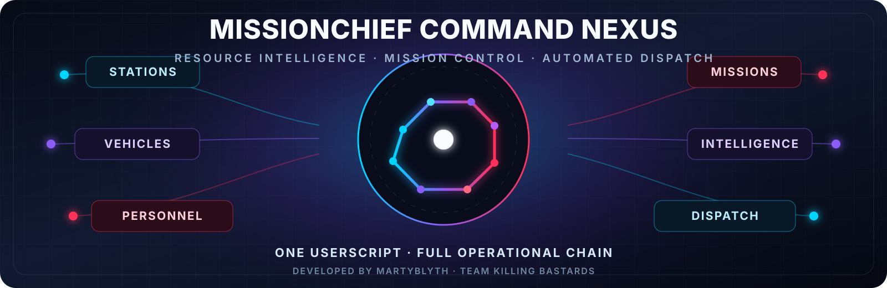

<div align="center">



# MissionChief Command Nexus

### The operational control layer for MissionChief UK

**Prepare resources. Verify capability. Read live demand. Match exactly. Dispatch with control.**

<table>
<tr>
<td width="25%" align="center"><a href="https://greasyfork.org/en/scripts/587702-missionchief-command-nexus"><strong>⬇ INSTALL / UPDATE</strong><br><sub>Recommended Greasy Fork route</sub></a></td>
<td width="25%" align="center"><a href="src/missionchief-command-nexus.user.js"><strong>⌘ VIEW SOURCE</strong><br><sub>Canonical userscript on main</sub></a></td>
<td width="25%" align="center"><a href="https://github.com/Team-Killing-Bastards/MissionChief-Command-Nexus/releases/latest"><strong>◈ LATEST RELEASE</strong><br><sub>Verified assets and checksum</sub></a></td>
<td width="25%" align="center"><a href="https://github.com/Team-Killing-Bastards/MissionChief-Command-Nexus/issues"><strong>⚠ COMMAND QUEUE</strong><br><sub>Bugs, gaps, and roadmap</sub></a></td>
</tr>
</table>

**Current version:** `1.0.49` · **Mission Finder engine:** `V10.6.113` · **Platform:** [MissionChief UK](https://www.missionchief.co.uk/) · **Licence:** [MIT](LICENSE)

[](https://github.com/Team-Killing-Bastards/MissionChief-Command-Nexus/actions/workflows/validate-userscript.yml)
[](https://github.com/Team-Killing-Bastards/MissionChief-Command-Nexus/actions/workflows/repository-quality.yml)

[**Command brief**](#command-brief) · [**Install**](#install-in-60-seconds) · [**Capability matrix**](#capability-matrix) · [**Operational chain**](#operational-chain) · [**Production status**](#current-production-capability) · [**Safety**](#safety-doctrine) · [**Architecture**](#system-architecture) · [**Ownership**](#ownership-and-contribution-record) · [**Release control**](#release-control)

</div>

---

## Command brief

MissionChief Command Nexus combines two proven MartyBlyth systems into one maintained MissionChief UK installation:

<table>
<tr>
<td width="50%" valign="top">

### 🛰️ Mission Operations Engine

- Live mission-requirement interpretation
- Complete vehicle-list loading
- Exact vehicle and trained-personnel matching
- Unit Finder and Mission Update
- Auto Mode, dispatch, upgrades, and continuation
- Patient, prisoner, and transport handling

</td>
<td width="50%" valign="top">

### 🧭 Resource Administration Engine

- Station and vehicle naming
- Personnel Assignment planning
- Preview and controlled Live modes
- Build Personnel Register
- Verified training-capability intelligence
- Progress, reporting, persistence, and cleanup

</td>
</tr>
</table>

The two engines remain deliberately isolated at runtime, but they share one critical operational contract: the **verified vehicle-training register**.

```text
STATIONS
   ↓
VEHICLES
   ↓
ASSIGNED PERSONNEL
   ↓
VERIFIED TRAINING CAPABILITY
   ↓
LIVE MISSION DEMAND
   ↓
EXACT RESOURCE MATCHING
   ↓
CONTROLLED DISPATCH
```

This is not a loose bundle of buttons. It is a connected operational chain from resource preparation to mission completion.

> [!IMPORTANT]
> **MartyBlyth is the creator, principal userscript author, technical owner, and release authority.** Command Nexus remains **MartyBlyth's project**. **Conroy1988 is the project helper** for repository infrastructure, documentation, validation, and general operations; after identifying the mobile workflow gap, he requested Marty's permission and independently initiated, designed, and implemented the scoped **iOS Safari compatibility** work delivered across v1.0.15-v1.0.18. That contribution does not change the project's overall ownership.

## Why Command Nexus exists

<table>
<tr>
<td width="25%" align="center"><strong>ONE INSTALLATION</strong><br><sub>One metadata block, one supported update route, one combined guard</sub></td>
<td width="25%" align="center"><strong>TWO PROVEN ENGINES</strong><br><sub>Independent failure boundaries with a shared operational contract</sub></td>
<td width="25%" align="center"><strong>VERIFIED INTELLIGENCE</strong><br><sub>Vehicle identity and personnel evidence—not display-name guesswork</sub></td>
<td width="25%" align="center"><strong>FAIL-CLOSED CONTROL</strong><br><sub>Incomplete, stale, or unsafe states block rather than improvise</sub></td>
</tr>
</table>

Command Nexus is designed for players who operate at scale and need repeatable resource preparation, specialist staffing intelligence, live mission interpretation, and controlled automation without running multiple overlapping scripts.

## Install in 60 seconds

1. Install **Tampermonkey** or **Violentmonkey**.
2. Open [MissionChief Command Nexus on Greasy Fork](https://greasyfork.org/en/scripts/587702-missionchief-command-nexus).
3. Select **Install this script** or **Update**.
4. Disable both legacy standalone scripts:
   - Mission Finder 2026 Trained Personal Update
   - MissionChief Unit, Station & Personnel Tools
5. Reload MissionChief.

> [!WARNING]
> Keep **one active Command Nexus installation only**. The combined userscript already contains both operational engines. Running legacy copies beside it can create duplicate interfaces, observers, selections, or dispatch behaviour.

The canonical source is [`src/missionchief-command-nexus.user.js`](src/missionchief-command-nexus.user.js) on `main`. Greasy Fork is the supported public installation and update channel.

## Capability matrix

### Resource command

| Capability | Operational behaviour |
|---|---|
| **Station naming** | Builds and previews structured station names from available station and location data |
| **Vehicle naming** | Applies repeatable captions and numbering across supported station and vehicle types |
| **Scoped processing** | Operates on a selected station scope with progress, pause, resume, and stop controls where supported |
| **Personnel Assignment** | Finds trained personnel, plans eligible assignments, supports Preview and Live modes, and verifies submitted changes |
| **Build Personnel Register** | Reads each discovered vehicle assignment page without changing assignments |
| **Training intelligence** | Stores exact verified vehicle/personnel capability for specialist mission matching |
| **Operational reporting** | Separates changed, skipped, failed, unfilled, and genuine training-shortage outcomes |

### Mission command

| Capability | Operational behaviour |
|---|---|
| **Unit Finder** | Reads current mission demand and selects mapped vehicles and trained personnel |
| **Mission Update / Upgrade** | Re-reads live requirements and adds only the remaining actionable shortage |
| **Auto Mode** | Loads the complete vehicle list, evaluates demand, selects resources, validates readiness, and dispatches as a managed cycle |
| **Patient demand** | Reconciles visible patients and ambulance demand when static mission text is incomplete |
| **Exact specialist matching** | Uses vehicle IDs, assignment-page evidence, and required qualifications |
| **Continuation** | Handles upgrades, queue progression, unattended recovery, and patient/prisoner transport controls |
| **Diagnostics** | Records completed, skipped, blocked, and failed outcomes while guarding against stale missions and repeated dispatch |

## Operational chain

### 1. Build trustworthy resource data

Resource Administration discovers stations and vehicles, reads assignment pages, and records verified capability. Naming and assignment workflows can be previewed before writes are made.

### 2. Read the mission that exists now

Unit Finder first checks the exact active mission for a visible current **Missing Vehicles** or supported **Missing Personnel** shortage. When one exists, that current shortage owns the selection pass and the full original mission definition is not sent again. Otherwise, Unit Finder reads the authoritative **Requirements for this Mission** endpoint and binds it to the exact active mission ID, including when MissionChief hides the desktop `#mission_help` button on iPhone and iPad. Mission Update separately re-reads the visible Live Mission Requirements panel and current alerts.

### 3. Load the complete candidate pool

Before Unit Finder, Mission Update, or Auto Mode selects resources, Command Nexus:

1. detects every visible `Load more vehicles` / `missing_vehicles_load` control;
2. loads each `offset_page` sequentially;
3. confirms that vehicle IDs or row count changed;
4. waits for controls and loading indicators to settle;
5. requires the final non-zero list to remain ID-stable; and
6. fails closed when the mission changes, loading stalls, or the bounded timeout is reached.

This prevents selection against a partial MissionChief vehicle table.

### 4. Match capability—not merely labels

Specialist decisions can use vehicle IDs, assignment-page evidence, the verified training register, current mission ownership, patient state, transport state, and current selections.

### 5. Confirm before dispatch

Auto Mode validates readiness and final selected-unit state before dispatch. Cross-mission drift, stale demand, incomplete evidence, and repeat-dispatch conditions are treated as blockers.

## Current production capability

### Authoritative iOS mission requirements

- Hidden `#mission_help.hidden-xs` links remain authoritative on iPhone and iPad even though MissionChief does not render the desktop button.
- Requirement URLs must remain same-origin, use `/einsaetze/{missionType}`, and match the exact active `mission_id`.
- Missing-link recovery uses only explicit active-mission type evidence; stale or mismatched links and responses block.
- The fetched Vehicle and Personnel Requirements table is verified before rows reach Unit Finder.

### iPhone Safari Mission Finder command card

- iPhone Mission Finder uses a compact two-button launcher—**Mission** and **Vehicle**—positioned with a stable 16px clearance to the left of MissionChief's complete native control cluster. Both panels start closed and open exclusively below the launcher.
- Primary mission actions remain immediately available in a compact two-column grid; Mission Ready Delay and Queue Restart sit behind a dedicated Settings disclosure.
- Vehicle Load List remains independently collapsible and uses bounded internal scrolling rather than consuming the entire mission viewport.
- MissionChief's native unit quick-select surface is also compacted: it defaults behind one **Unit Quick Select** disclosure, then opens into a horizontal category strip and a two-column internally scrolling grid.
- The native controls are styled in their owning mission document, including same-origin mission iframes; original `search_attribute` links and click behaviour remain intact.
- Safe-area insets, `visualViewport`, dynamic viewport height and Safari address-bar changes are handled without enabling this layout on iPad or desktop. Safari **Request Desktop Website** sessions on a physical iPhone are recognised by phone-sized screen dimensions rather than the misleading `MacIntel` label. Launcher geometry uses full-cluster measurement, a farther-left fallback and pixel hysteresis; MissionChief's native quick-select receives passive selector styling only; Command Nexus no longer injects a Unit Quick Select wrapper, disclosure or collapse state.

### iOS Safari Unit Finder selection

- Unit Finder resolves vehicle controls from the active mission document when MissionChief uses responsive content, a same-origin iframe or a lightbox mission surface.
- A unit is counted only after the exact MissionChief vehicle checkbox is confirmed checked.
- Native checkbox activation remains first; Safari receives an associated-label fallback and a bounded checked-property plus `input`/`change` fallback only when native activation did not alter the real checkbox.
- Complete-list loading, spinner detection, fallback controls and final selection counts now use the same mission document.
- Failed or disabled selections remain fail closed and do not advance assigned-unit totals.

### Runtime hardening

- Permanent userscript observers were reduced from three to two.
- Resource Administration now uses one filtered and animation-frame-coalesced lifecycle controller instead of two broad iOS observers.
- Mission Finder ignores mutations generated by its own interface unless they represent a genuine wrapper lifecycle event.
- Safari bfcache entry preserves the runtime; genuine unload performs deterministic cleanup.
- Global registry, pagehide, pageshow, viewport, navigation, and observer ownership have explicit teardown paths.
- Permanent CI protects the runtime-hardening contracts from regression.

### Seasonal mission collectibles

- Visible event items using MissionChief's exact `#easter-egg-link` and `/missions/{id}/claim_found_object_sync` route are collected automatically without leaving the mission.
- The current summer sunflower item is covered, including mission pages rendered inside same-origin lightboxes and iframes.
- Collection adds no new DOM observer and uses bounded duplicate-request protection.

### Verified Fire capability

- Railway Fire: 2 trained personnel per exact type-107 RRU.
- Level 1 Incident Commander: 3 trained personnel per exact type-15 ICCU.
- HazMat Unit: 3 trained personnel per exact type-39 Fire OSU.
- BASU, Welfare, and HazMat reuse one selected Fire OSU; type-86 SAR vans remain separate.
- `Fire, rescue or aerial appliance` maps to `Rescue Pump`.
- `Road Rail Unit` maps to `RRU`.
- `Firefighters` converts to Rescue Pumps at 9 personnel per vehicle.
- `Car Recovery`, `Car to tow`, and `Cars to tow` use exact type-105 Flatbed Recovery Vehicles.
- `RIV or Major Foam Tender` uses RIV first and Major Foam Tender only when no RIV is available.

High Volume Pump, Drone Operator, Co-Responder, and Lifeguard remain disabled pending sufficient evidence.

### Live requirements authority

- Visible current **Missing Vehicles** and supported **Missing Personnel** alerts are checked before the full mission-help requirement set in both manual Unit Finder and Auto Mode.
- An explicit current shortage suppresses unrelated original mission totals. Current patient shortages remain included.
- Explicit Missing Vehicles quantities are current checked-selection targets: matching vehicles already selected reduce the additional clicks and prevent a second pass from duplicating the shortage.
- Numeric `Still Needed` values in the Live Mission Requirements table remain direct additional shortages.
- Bounded values such as `0-3` use their upper actionable bound.
- A literal unknown `?` falls back to `Required` as a total target and deducts existing matching selections.
- Successful selection clicks are included in final confirmation.
- Patient-only alerts do not suppress the authoritative mission-help route.

### Police, rescue, maritime, and medical handling

- Ordinary Police attendance prefers verified ordinary type-8 IRVs, then unknown or stale type-8 IRVs, and uses specialist-trained type-8 IRVs only when needed as a final fallback.
- Any selected exact type-8 IRV counts toward generic Police Car attendance; named specialist requirements remain strict and live-verified.
- Police Officer upgrade rows and visible `Missing Personnel` alerts convert at two officers per Police Car, including when the live requirements panel is present.
- Supported trained-personnel requirements use best-available coverage rather than an all-or-nothing qualification gate. Multi-trained staff count toward every matching course they hold.
- Level 1, Level 2, Sergeant and Police Medic demand can use exact type-51 PSUs at up to nine personnel or exact type-8 IRVs at two personnel. PSUs cover useful larger blocks and IRVs fill smaller remainders without unnecessary extra units.
- Partially trained units remain eligible. When training is insufficient, correct-type fallback vehicles are still selected and the exact remaining training shortfall is reported without blocking dispatch.
- Police Inspector and Railway Police remain exact type-8 trained-personnel profiles.
- Armed Personnel and Armed Response Personnel route to exact type-25 Armed Traffic Cars.
- Armed Traffic Car selection verifies Roads Policing plus Firearms capability.
- Generic type-66 `4x4 Vehicle` matching is restored.
- Search Advisor demand selects any exact registered vehicle carrying assigned `search_and_rescue`-trained staff; Police station personnel rows also preserve the persistent **Assigned To** binding when MissionChief marks the officer Available, while ambiguous vehicle names fail closed.
- SAR Commander demand converts to Control Van capability.
- `Operational Support or SAR Vehicle` selects and verifies the exact type-86 Operational Support Van.
- Seagoing Vessel requirements recognise supported ALB / ABL / All-weather Lifeboat variants.
- ATV Carrier matching uses authoritative vehicle type `30` without confusing it with Armed Traffic Cars.
- Patient and ambulance demand is reconciled across repeated selection passes.

## Platform matrix

| Environment | Status | Notes |
|---|---|---|
| **Desktop browser** | Primary | Full Resource Administration and Mission Operations target |
| **iPhone Safari website** | Supported | Compact native-style Mission Finder command card, Resource Administration and active-mission Unit Finder selection |
| **iPad Safari website** | Supported | Includes touch-capable `MacIntel` desktop-site detection and active-mission Unit Finder selection |
| **Chrome / Firefox / Edge on iOS** | Not treated as Safari | Safari-specific compatibility paths remain isolated |
| **MissionChief native app / webview** | Not treated as Safari website | Native wrappers are outside the documented Safari website scope |
| **Other Mission Finder surfaces on mobile** | Desktop-first | Supported only where explicitly documented |

### iOS Safari command surfaces

- Responsive station-list markup is recognised without weakening the desktop station-page guard.
- Unit Naming, Station Naming, Personnel Assignment, and Build Personnel Register share one responsive station-discovery layer.
- Resource Administration appears only on the rendered personal Stations view; Map, Missions, Chat, and Radio hide the same stateful panel instance.
- Responsive `Details` links can use a hidden same-origin station iframe when the desktop lightbox binding is unavailable.
- Resource Administration uses safe-area insets, touch scrolling, pointer dragging, and deterministic cleanup.
- Mission Control opens at the safe-area top, stacks to the mobile viewport, scrolls internally, and supports independent collapse controls.
- Unit Finder reads the hidden or visible Requirements for this Mission source for the exact active mission before selecting units.
- Unit Finder follows the active mission document and verifies the exact MissionChief checkbox state before counting a selected unit.
- Safari address-bar changes, rotation, history restoration, and bfcache restoration trigger bounded viewport reconciliation.

> [!NOTE]
> The iOS Safari compatibility work was initiated, designed, and implemented by **[Conroy1988](https://github.com/Conroy1988)** after he identified the need in his own iPhone and iPad workflow. He requested permission to contribute and **[MartyBlyth](https://github.com/Martyblyth)** approved the scoped contribution. The underlying Unit, Station & Personnel system and Mission Finder engine remain Marty's work.

## Safety doctrine

Command Nexus can rename account resources, change personnel assignments, select vehicles, and dispatch missions. It must be operated as controlled automation.

<table>
<tr>
<td width="33%" valign="top"><strong>PREVIEW FIRST</strong><br><sub>Inspect naming and personnel-assignment plans before enabling writes.</sub></td>
<td width="33%" valign="top"><strong>VERIFY EVIDENCE</strong><br><sub>Refresh the Personnel Register before depending on specialist capability.</sub></td>
<td width="33%" valign="top"><strong>FAIL CLOSED</strong><br><sub>Unsupported, stale, partial, or structurally incomplete demand must block.</sub></td>
</tr>
</table>

- Test a small station scope before a large batch.
- Observe Auto Mode on representative missions before unattended use.
- Treat unsupported demand and staffing shortages as blocking conditions.
- Stop and report cross-mission selection, repeated dispatch, or incorrect personnel assignment.
- Review the [changelog](CHANGELOG.md) and open issues before major operational use.

Supported domains:

```text
https://www.missionchief.co.uk/*
https://police.missionchief.co.uk/*
```

## Known limitations

Command Nexus is operational software, not a claim that every MissionChief UK vehicle, course, mission, or markup variant is fully mapped.

| Limitation | Current position |
|---|---|
| **Country coverage** | MissionChief UK only |
| **Training profiles** | Remaining Medical, Fire, Airfield, SAR, Mountain Rescue, and Coastguard profiles are tracked through issues |
| **External requirements data** | Some specialist logic depends on stable requirement data exposed by MissionChief or compatible panels |
| **PSU personnel assignment** | Mission dispatch now uses nine-seat PSU coverage; automatic station personnel assignment into PSU seats remains tracked separately |
| **Interface consolidation** | One installation still contains two retained operational control surfaces |
| **Mobile coverage** | Dedicated iOS Safari support covers Resource Administration and Mission Control; other surfaces remain desktop-first unless documented |
| **Live-game variability** | MissionChief markup, labels, routes, and mission data can change independently of this repository |

Use the [issue tracker](https://github.com/Team-Killing-Bastards/MissionChief-Command-Nexus/issues) as the authoritative development queue.

## System architecture

```text
MISSIONCHIEF COMMAND NEXUS
│
├── Combined userscript metadata and installation guard
│
├── RESOURCE ADMINISTRATION ENGINE
│   ├── Station and vehicle naming
│   ├── Personnel Assignment
│   ├── Build Personnel Register
│   ├── Verified training profiles
│   ├── Reports, persistence, and bounded cleanup
│   └── iOS Safari Stations lifecycle controller
│
├── SHARED VEHICLE-TRAINING REGISTER
│   └── Exact vehicle identity + assigned personnel capability
│
└── MISSION OPERATIONS ENGINE
    ├── Live requirements and patient parsing
    ├── Complete vehicle-list loading
    ├── Exact vehicle and trained-personnel matching
    ├── Unit Finder and Mission Update
    ├── Auto Mode, dispatch, and sharing
    ├── Upgrades, queues, collectibles, and transport continuation
    └── Mutation filtering, bfcache preservation, and lifecycle teardown
```

The separation is deliberate: a startup or runtime fault in one engine should not silently destroy the other. The shared register is the bridge, not a forced merge of mature internal systems.

See [Architecture](docs/ARCHITECTURE.md) and [Developer Handoff](docs/DEVELOPER_HANDOFF.md) for deeper engineering detail.

## Release control

```text
FOCUSED CHANGE
      ↓
VERSION + CHANGELOG CONTRACT
      ↓
PULL REQUEST VALIDATION
      ↓
CANONICAL MAIN
      ↓
IMMUTABLE TAG + GITHUB RELEASE
      ↓
ASSET + SHA-256 VERIFICATION
      ↓
GITHUB / RELEASE / GREASY FORK SOURCE PARITY
      ↓
COMMAND NEXUS RELEASE CONTROL DISCORD ANNOUNCEMENT
```

Repository validation covers:

- JavaScript syntax;
- userscript metadata and version consistency;
- iOS Safari compatibility contracts;
- runtime performance and lifecycle ownership contracts;
- required repository and policy files;
- README links, anchors, artwork, and GitHub-native badges;
- Marty ownership and scoped contribution attribution;
- release assets and SHA-256 verification; and
- recovery from partial, empty, starter, or mismatched releases.

Discord is notified only after the immutable GitHub source, release asset, checksum, and Greasy Fork source satisfy the release contract.

## Ownership and contribution record

Command Nexus remains **MartyBlyth's project**. Feature-level attribution records who delivered specific work without collapsing the project's ownership boundary.

| Contributor | Role and responsibility |
|---|---|
| **[MartyBlyth](https://github.com/Martyblyth)** | Creator, principal userscript author, technical owner, and release authority; original author of Mission Finder and the Unit, Station & Personnel systems; responsible for technical direction, release decisions, and ongoing feature authority |
| **[Conroy1988](https://github.com/Conroy1988)** | Project helper for repository infrastructure, documentation, validation, and general operations; independently initiated the scoped iOS Safari work, obtained Marty's permission, and designed and implemented the v1.0.15 compatibility layer, v1.0.16 station-workflow hardening, and v1.0.18 Mission Control Safari layout |

## Development and support

| Destination | Purpose |
|---|---|
| [Greasy Fork](https://greasyfork.org/en/scripts/587702-missionchief-command-nexus) | Supported installation and updates |
| [Latest release](https://github.com/Team-Killing-Bastards/MissionChief-Command-Nexus/releases/latest) | Verified source, release assets, and checksum |
| [Issues](https://github.com/Team-Killing-Bastards/MissionChief-Command-Nexus/issues) | Bugs, limitations, and planned work |
| [Changelog](CHANGELOG.md) | Version history and mission briefs |
| [Architecture](docs/ARCHITECTURE.md) | Runtime and integration design |
| [Testing](docs/TESTING.md) | Compatibility and release-blocking validation |
| [Roadmap](docs/ROADMAP.md) | Planned development phases |
| [Developer Handoff](docs/DEVELOPER_HANDOFF.md) | Current source-development context |
| [Support](SUPPORT.md) | Support scope and reporting guidance |

<div align="center">

---

### One installation. Two proven engines. One operational chain.

**Created and technically owned by [MartyBlyth](https://github.com/Martyblyth).**  
Repository infrastructure, documentation, validation, and the independently initiated v1.0.15-v1.0.18 iOS Safari compatibility contribution by [Conroy1988](https://github.com/Conroy1988), delivered with Marty's permission.

**MissionChief Command Nexus — prepare with intelligence, dispatch with control.**

</div>
