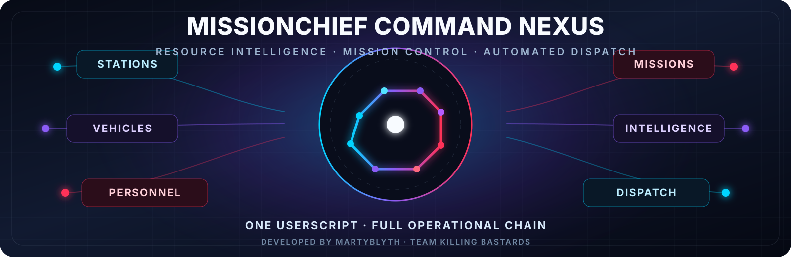

# MissionChief Command Nexus

### Mission dispatch and fleet management for MissionChief UK

**A Chrome extension by MartyBlyth. Install once and receive updates through Chrome.**

[**Install from the Chrome Web Store**](https://chromewebstore.google.com/detail/missionchief-command-nexu/pheccockibcappcdgonjjfcmlkemmaln) · [**What’s changed**](docs/extension-changelog.md) · [**Support**](SUPPORT.md)

**Current version:** `3.0.43.205` · **Manifest V3** · **Licence:** [MIT](LICENSE)

Store version verified on 7 October 2026. Chrome may deliver approved updates at different times; check your installed version in `chrome://extensions`.

## Install and update

1. Open [MissionChief Command Nexus in the Chrome Web Store](https://chromewebstore.google.com/detail/missionchief-command-nexu/pheccockibcappcdgonjjfcmlkemmaln).
2. Select **Add to Chrome** and confirm the browser prompt.
3. Disable any older Command Nexus userscript in Tampermonkey or Violentmonkey, both standalone Marty scripts, and any duplicate unpacked Nexus extension.
4. Reload your MissionChief tabs and confirm the Nexus interface appears once.

No userscript manager is required. Chrome manages updates for the Store installation. After an update, stop active automation and reload open game tabs before restarting it. Read recent changes in **Nexus Tools → Overview → What’s changed**.

**Keep one active Nexus installation.** The old Greasy Fork and raw `.user.js` downloads are legacy distribution, not the supported installation or update route. Back up available settings before switching; userscript and extension storage do not automatically transfer. See the [migration guide](docs/MIGRATION.md).

Designed for [MissionChief UK](https://www.missionchief.co.uk/) and [Police MissionChief UK](https://police.missionchief.co.uk/). A MissionChief account is required. This Chrome listing does not establish Safari/iOS or other-browser compatibility.

## What Nexus does

Nexus combines mission controls, vehicle selection and transport assistance with fleet naming, personnel assignment and custom requirement rules. It also includes alliance mission support, compact mission cards, building information, station checks and optional Discord account sync.

## Capability matrix

### Resource command

| Capability | Operational behaviour |
|---|---|
| **Station naming** | Builds and previews structured station names, then submits MissionChief's exact native edit form in the background and verifies the saved value |
| **Vehicle naming** | Applies repeatable captions and numbering through background native-form requests, with exact vehicle-ID and post-save verification |
| **Scoped processing** | Operates on a selected station scope with progress, pause, resume, and stop controls where supported |
| **Personnel Assignment** | Finds trained personnel, plans eligible assignments, and performs Live submissions plus fresh verification reads entirely in the background; Medical, Fire/Airfield, Police and SAR/Coastguard profiles use exact UK vehicle, course, seat and building mappings |
| **Build Personnel Register** | Reads each discovered vehicle assignment page without changing assignments |
| **Training intelligence** | Stores exact verified vehicle/personnel capability for specialist mission matching |
| **Operational reporting** | Separates changed, skipped, failed, unfilled, and genuine training-shortage outcomes |

### Mission command

| Capability | Operational behaviour |
|---|---|
| **Unit Finder** | Reads current mission demand and selects mapped vehicles and trained personnel |
| **Mission Update / Upgrade** | Re-reads live requirements and adds only the remaining actionable shortage |
| **Auto Mode** | Loads the complete vehicle list, evaluates demand, selects resources, validates readiness, and dispatches as a managed cycle; below two actionable personal missions it releases the active worker and resumes from a fresh A only after two missions are stable |
| **Patient demand** | Reconciles visible patients and ambulance demand when static mission text is incomplete |
| **Exact specialist matching** | Uses vehicle IDs, assignment-page evidence, and required qualifications |
| **Continuation** | Handles upgrades, queue progression, unattended recovery, and patient/prisoner transport controls |
| **Diagnostics** | Records completed, skipped, blocked, and failed outcomes while guarding against stale missions and repeated dispatch |

## Recent extension improvements

- A one-time update notice with links to versioned GitHub change notes.
- Automatic station checks and individual station checks.
- Fresh station evidence shared between game tabs.
- Improved SAR vehicle requirement handling.
- Discord sign-in and supported profile/register sync across PCs.

See the [extension changelog](docs/extension-changelog.md) for version-by-version details.

## Data and privacy

Gameplay records are stored locally. New installations enable uploads to the project owner’s Nexus collector by default; existing upload-off choices are preserved. You can turn uploads off in **Private collector** while retaining local recording. Optional Discord sign-in connects supported settings, profiles and personnel-register records across browsers.

Read the [privacy policy](docs/extension-privacy-policy.md) for collected fields, storage, controls and deletion requests. Do not post private exports, account tokens or credentials in GitHub issues.

## Support and safe operation

Use [GitHub issues](https://github.com/Team-Killing-Bastards/MissionChief-Command-Nexus/issues) for bugs and feature requests. Include the extension version, browser/OS, installation source, affected workflow and sanitized evidence. See [support guidance](SUPPORT.md).

Preview bulk administration changes, test small scopes first and confirm manual controls before enabling Auto Mode. Stop automation if actions repeat or target the wrong resources. For sensitive issues, follow [SECURITY.md](SECURITY.md).

## Source and development

| Resource | Purpose |
|---|---|
| [Current extension source](extension-candidates/3.0.43.205/extension) | Versioned Manifest V3 source matching the current Store version number |
| [Build and validation guide](extension-candidates/3.0.43.205/README.md) | Package provenance, checks and ZIP creation |
| [Project state](docs/PROJECT_STATE.md) | Current distribution, source pointers and retained engineering records |
| [Developer handoff](docs/DEVELOPER_HANDOFF.md) | Implementation and development workflow |
| [Release process](docs/RELEASE_PROCESS.md) | Package, submission, review and rollout are separate stages |
| [Contributing](CONTRIBUTING.md) | Contribution and validation requirements |

The directory name `extension-candidates` is retained for stable links; the Store now lists `3.0.43.205`. Its version match alone is not a byte-for-byte audit of the Store package. The `browser-extension` directory is the older `.82` build pipeline, and `src/missionchief-command-nexus.user.js` is the retained `3.0.43` userscript baseline. Neither is the current installation route.

Routine repository maintenance does not publish or announce legacy userscript releases. Historical release assets and the [userscript changelog](CHANGELOG.md) remain available for provenance.

## Ownership and contribution record

> **MartyBlyth is the creator, principal userscript author, technical owner, and release authority.** Command Nexus remains **MartyBlyth's project**. **Conroy1988 is the project helper** for repository infrastructure, documentation, validation, and general operations; after identifying the mobile workflow gap, he requested Marty's permission and independently initiated, designed, and implemented the scoped **iOS Safari compatibility** work delivered across v1.0.15-v1.0.18. That contribution does not change the project's overall ownership.

MissionChief Command Nexus is an independent community extension, not affiliated with or endorsed by MissionChief or its operators.
